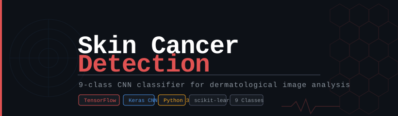
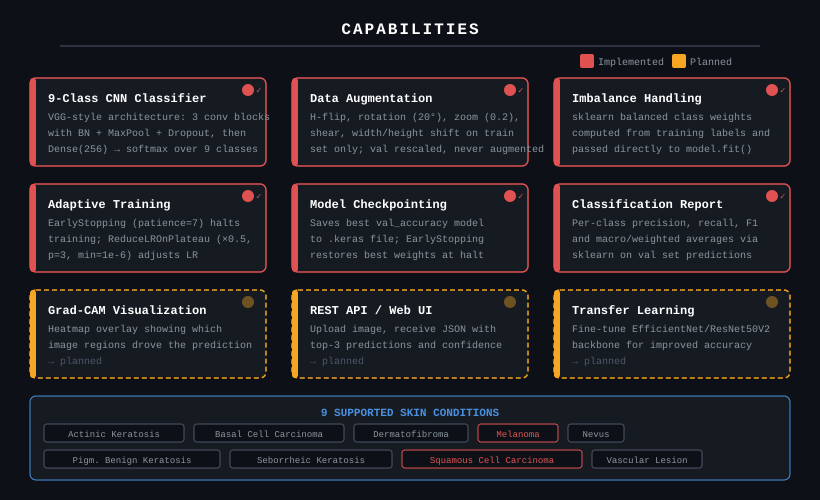
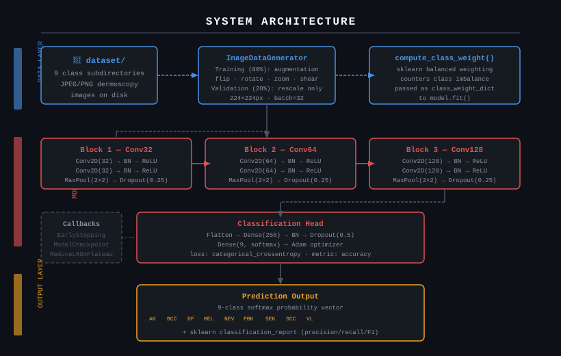
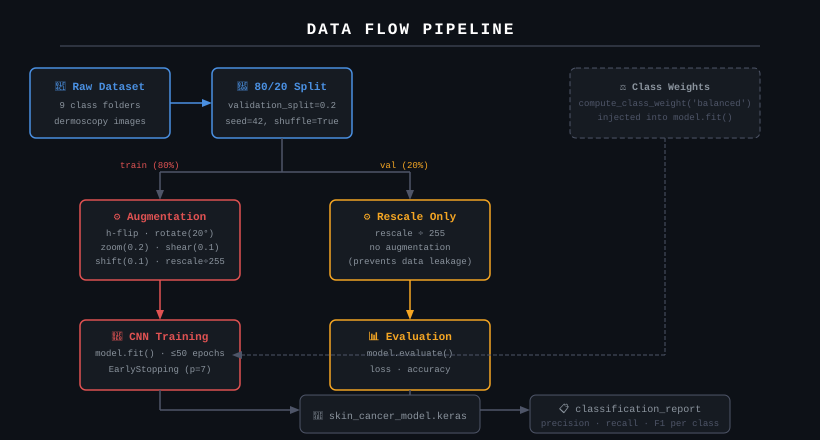
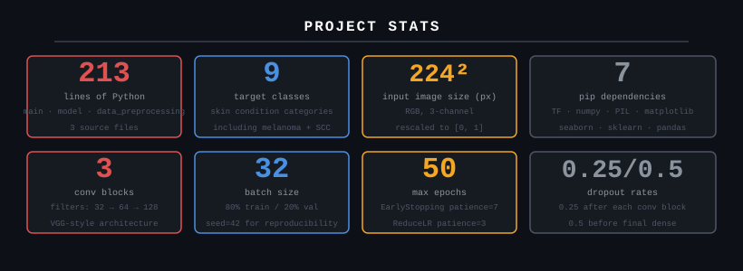

<p align="center">
  
</p>

**A VGG-style CNN that stares at dermoscopy images and tells you which of nine skin conditions it thinks it's looking at.**

[Features](#features) • [Installation](#installation) • [Usage](#usage) • [Architecture](#architecture) • [Roadmap](#roadmap) • [License](#license)

---

*This project exists because early detection genuinely changes outcomes for melanoma and squamous cell carcinoma — and because "train a classifier on labelled dermoscopy images" is the kind of problem where a well-tuned CNN can be both instructive and useful. No pretrained backbone, no web service, just clean PyTorch-free TensorFlow code you can read in an afternoon.*

Skin Cancer Detection is a Python pipeline that ingests a folder of labelled dermoscopy images, augments the training set, trains a custom 3-block VGG-style convolutional network, and emits both a saved `.keras` model and a full sklearn classification report. It uses TensorFlow/Keras for the model, `scikit-learn` for class-weight balancing and metrics, and `ImageDataGenerator` for on-the-fly augmentation. Nine skin conditions are targeted: from mundane nevi through actinic keratosis all the way to melanoma and squamous cell carcinoma.

---

[](https://www.python.org/)
[](https://tensorflow.org)
[](https://scikit-learn.org)
[](https://github.com/Kaelith69/skin-cancer-detection)
[](LICENSE)
[](dataset/)

---

## System Overview

The project is three Python files and a dataset directory. `data_preprocessing.py` owns all data loading and augmentation logic. `model.py` defines and compiles the network. `main.py` wires them together: loads data, computes class weights, trains with callbacks, evaluates, and prints the classification report.

```
skin-cancer-detection/
├── main.py                   # Training entrypoint — wires everything together
├── model.py                  # CNN architecture definition + compilation
├── data_preprocessing.py     # ImageDataGenerator config, 80/20 split, augmentation
├── requirements.txt          # 7 pip dependencies
├── dataset/                  # Root of labelled image data
│   ├── actinic_keratosis/
│   ├── basal_cell_carcinoma/
│   ├── dermatofibroma/
│   ├── melanoma/
│   ├── nevus/
│   ├── pigmented_benign_keratosis/
│   ├── seborrheic_keratosis/
│   ├── squamous_cell_carcinoma/
│   └── vascular_lesion/
├── assets/                   # SVG documentation assets
├── docs/
├── wiki/
├── CONTRIBUTING.md
└── LICENSE
```

See the [architecture diagram](#architecture) below for how the components relate at runtime.

---

## Features

| Feature | What it actually does |
|---|---|
| 🧠 **9-Class CNN** | 3 conv blocks (32/64/128 filters) with BatchNorm, MaxPool, and Dropout, feeding a Dense(256) head with softmax over 9 skin condition classes |
| 🔀 **Train/Val Split** | `ImageDataGenerator` handles the 80/20 split in-memory at load time with `seed=42` so runs are reproducible |
| 🔬 **Augmentation** | Horizontal flip, rotation ±20°, zoom 20%, shear 0.1, width/height shift 0.1 — applied to training batches only, never to validation |
| ⚖️ **Class Balancing** | `sklearn.utils.class_weight.compute_class_weight('balanced')` computes per-class loss multipliers from training label distribution |
| ⏱️ **EarlyStopping** | Monitors `val_loss`, stops after 7 epochs without improvement, and restores the best weights from that run |
| 📉 **ReduceLROnPlateau** | Halves learning rate when `val_loss` plateaus for 3 epochs; floors at 1e-6 to prevent total collapse |
| 💾 **ModelCheckpoint** | Writes `skin_cancer_model.keras` only when `val_accuracy` improves — you always get the best model, not just the last one |
| 📋 **Classification Report** | Runs `sklearn.metrics.classification_report` on val-set predictions and prints per-class precision, recall, F1, and macro/weighted averages |

---

## Capability Visualization

<p align="center">
  
</p>

---

## Architecture

<p align="center">
  
</p>

The model is a `Sequential` stack — intentionally. There are no skip connections, no attention heads, no pretrained weights. Three convolutional blocks each follow the same pattern: two `Conv2D` layers with same-padding and ReLU activation, each followed by `BatchNormalization`; then `MaxPooling2D(2,2)` to halve spatial dimensions; then `Dropout(0.25)`. Filter depth doubles each block: 32 → 64 → 128.

The classification head flattens the feature map, passes it through `Dense(256)` with BatchNorm and `Dropout(0.5)`, then a final `Dense(num_classes, activation='softmax')`. Training uses Adam with `categorical_crossentropy`. The choice to avoid a pretrained backbone is deliberate — this codebase is meant to be readable and self-contained. The class-weight dict fed to `model.fit()` ensures that rare conditions like squamous cell carcinoma don't get drowned out by common classes like nevus.

---

## Data Flow

<p align="center">
  
</p>

Primary data path:

```
dataset/
  └─ <class_folder>/*.jpg
        │
        ├─ train split (80%) ──→ augmentation ──→ batches of 32 → model.fit()
        │                                                              │
        │                                               class_weight_dict (sklearn)
        │
        └─ val split (20%) ────→ rescale only ──→ model.evaluate() + classification_report
                                                          │
                                                   skin_cancer_model.keras
```

---

## Installation

1. **Clone the repository**

   ```bash
   git clone https://github.com/Kaelith69/skin-cancer-detection.git
   cd skin-cancer-detection
   ```

2. **Create and activate a virtual environment** (keeps your system Python clean)

   ```bash
   python -m venv venv
   source venv/bin/activate      # macOS/Linux
   venv\Scripts\activate.bat     # Windows
   ```

3. **Install dependencies**

   ```bash
   pip install -r requirements.txt
   ```

   | Package | Why it's here |
   |---|---|
   | `tensorflow>=2.12.0` | Model definition, training loop, all Keras layers |
   | `numpy>=1.24.0` | Array ops for class-weight calculation and prediction indexing |
   | `Pillow>=9.5.0` | Image decoding backend used by `ImageDataGenerator` |
   | `matplotlib>=3.7.0` | Optional — for plotting training curves |
   | `seaborn>=0.12.0` | Optional — for confusion matrix heatmaps |
   | `scikit-learn>=1.2.0` | Class weight computation + classification report |
   | `pandas>=2.0.0` | Optional — for tabular metric summaries |

4. **Populate the dataset** — the `dataset/` directory must contain one subfolder per class, each containing image files. The folder names become the class labels.

   ```
   dataset/
   ├── melanoma/         ← images go here
   ├── nevus/
   └── ...
   ```

   > **Pro tip:** The ISIC Archive (https://www.isic-archive.com) provides large, well-labelled dermoscopy datasets. Download and arrange by diagnosis to match the expected folder structure. Class imbalance is real here — melanoma images are far fewer than nevus. The class-weight computation handles this, but more data always helps.

---

## Usage

1. **Activate your virtual environment** if not already active.

2. **Run training:**

   ```bash
   python main.py
   ```

3. Training will print per-epoch `loss` and `val_loss`. EarlyStopping will halt training if val_loss stops improving for 7 consecutive epochs. The best model is written to `skin_cancer_model.keras`.

4. **Read the output:** After training completes, you'll see:

   ```
   Validation Loss:     0.XXXX
   Validation Accuracy: XX.XX%

   Classification Report:

                                  precision    recall  f1-score   support
               actinic_keratosis       0.XX      0.XX      0.XX       XXX
             basal_cell_carcinoma       0.XX      0.XX      0.XX       XXX
                  ...
   ```

5. **Load and use the saved model:**

   ```python
   import numpy as np
   from tensorflow.keras.models import load_model
   from tensorflow.keras.preprocessing import image

   model = load_model('skin_cancer_model.keras')

   img = image.load_img('path/to/image.jpg', target_size=(224, 224))
   x = image.img_to_array(img) / 255.0
   x = np.expand_dims(x, axis=0)

   preds = model.predict(x)
   print(preds)  # softmax probability over 9 classes
   ```

---

## Project Structure

```
skin-cancer-detection/
│
├── 🐍 main.py                   # Entry point — loads data, trains model, prints report
├── 🧠 model.py                  # build_model() — Sequential CNN definition + compilation
├── 📦 data_preprocessing.py     # load_data() — ImageDataGenerator, split, augmentation config
├── 📋 requirements.txt          # Pinned dependency versions
│
├── 📁 dataset/                  # Image data root (not tracked in git)
│   ├── actinic_keratosis/       # Class folder → images
│   ├── basal_cell_carcinoma/
│   ├── dermatofibroma/
│   ├── melanoma/
│   ├── nevus/
│   ├── pigmented_benign_keratosis/
│   ├── seborrheic_keratosis/
│   ├── squamous_cell_carcinoma/
│   └── vascular_lesion/
│
├── 🖼️  assets/                  # SVG documentation assets
│   ├── hero-banner.svg
│   ├── architecture.svg
│   ├── data-flow.svg
│   ├── capabilities.svg
│   └── stats.svg
│
├── 📚 docs/                     # Additional documentation
├── 📖 wiki/                     # Wiki content
├── 🤝 CONTRIBUTING.md
└── ⚖️  LICENSE
```

---

## Performance Stats

<p align="center">
  
</p>

---

## Privacy

This project runs entirely locally. No image data, predictions, or model weights leave your machine. There is no telemetry, no logging service, and no network calls of any kind during training or inference. Images you place in `dataset/` are read from disk and processed in memory — nothing is uploaded anywhere.

---

## Roadmap

### Model Quality
- [x] Custom VGG-style CNN baseline
- [x] Data augmentation for training robustness
- [x] Balanced class weights to handle skewed label distribution
- [ ] Transfer learning with EfficientNetV2 or ResNet50V2 backbone
- [ ] Cross-validation across multiple folds
- [ ] Hyperparameter search (learning rate, dropout, dense size)

### Explainability
- [ ] Grad-CAM heatmap overlays showing per-image attention
- [ ] Confusion matrix visualization output

### Deployment
- [ ] REST API (FastAPI) accepting image upload, returning top-3 predictions
- [ ] Simple web UI for single-image inference
- [ ] Docker image for reproducible deployment

### Data
- [ ] Automated ISIC dataset download script
- [ ] Data validation and integrity checks
- [ ] Support for DICOM input format

---

## Packaging

To produce a standalone training script without the virtual environment:

```bash
pip install pyinstaller
pyinstaller --onefile main.py
```

Note: TensorFlow's binary size makes this impractical for distribution. For deployment, prefer Docker:

```bash
docker build -t skin-cancer-detection .
docker run --gpus all -v $(pwd)/dataset:/app/dataset skin-cancer-detection
```

(A `Dockerfile` is on the roadmap.)

---

## Contributing

Contributions are welcome. Please read [CONTRIBUTING.md](CONTRIBUTING.md) before opening a pull request.

---

## Security

If you discover a security vulnerability, please follow the instructions in [SECURITY.md](SECURITY.md) (if present) or open a private issue. Do not post credentials or patient data in issues or pull requests.

---

## License

MIT — see [LICENSE](LICENSE) for details. Built by [Kaelith69](https://github.com/Kaelith69).
