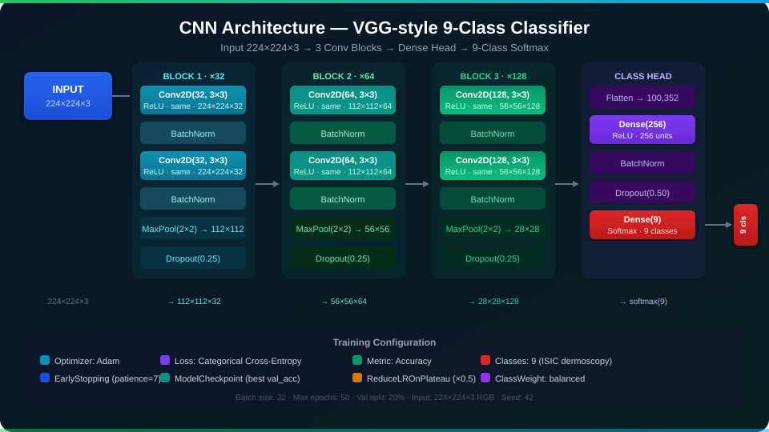
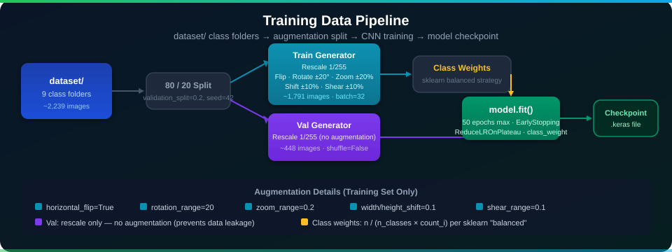

<div align="center">

<svg xmlns="http://www.w3.org/2000/svg" viewBox="0 0 860 200" width="860" height="200" role="img" aria-label="Architecture page header">
  <defs>
    <linearGradient id="archHeroBg" x1="0%" y1="0%" x2="100%" y2="100%">
      <stop offset="0%" style="stop-color:#0a1628;stop-opacity:1"/>
      <stop offset="50%" style="stop-color:#12103a;stop-opacity:1"/>
      <stop offset="100%" style="stop-color:#0d0a2e;stop-opacity:1"/>
    </linearGradient>
    <linearGradient id="archAccent" x1="0%" y1="0%" x2="100%" y2="0%">
      <stop offset="0%" style="stop-color:#7c3aed;stop-opacity:1"/>
      <stop offset="100%" style="stop-color:#0ea5e9;stop-opacity:1"/>
    </linearGradient>
    <filter id="archGlow">
      <feGaussianBlur stdDeviation="3" result="blur"/>
      <feMerge><feMergeNode in="blur"/><feMergeNode in="SourceGraphic"/></feMerge>
    </filter>
  </defs>
  <rect width="860" height="200" rx="14" fill="url(#archHeroBg)"/>
  <g opacity="0.04" stroke="#7c3aed" stroke-width="1" fill="none">
    <line x1="0" y1="40" x2="860" y2="40"/><line x1="0" y1="80" x2="860" y2="80"/>
    <line x1="0" y1="120" x2="860" y2="120"/><line x1="0" y1="160" x2="860" y2="160"/>
    <line x1="86" y1="0" x2="86" y2="200"/><line x1="172" y1="0" x2="172" y2="200"/>
    <line x1="258" y1="0" x2="258" y2="200"/><line x1="344" y1="0" x2="344" y2="200"/>
    <line x1="430" y1="0" x2="430" y2="200"/><line x1="516" y1="0" x2="516" y2="200"/>
    <line x1="602" y1="0" x2="602" y2="200"/><line x1="688" y1="0" x2="688" y2="200"/>
    <line x1="774" y1="0" x2="774" y2="200"/>
  </g>
  <circle cx="760" cy="40" r="80" fill="#7c3aed" opacity="0.07"/>
  <circle cx="100" cy="160" r="70" fill="#0ea5e9" opacity="0.07"/>
  <rect x="0" y="0" width="860" height="4" fill="url(#archAccent)" opacity="0.9"/>
  <text x="430" y="88" font-family="'Segoe UI',system-ui,Arial,sans-serif" font-size="36"
        font-weight="800" fill="white" text-anchor="middle" filter="url(#archGlow)">Architecture</text>
  <text x="430" y="122" font-family="'Segoe UI',system-ui,Arial,sans-serif" font-size="15"
        fill="#c4b5fd" text-anchor="middle">VGG-style CNN · 3 Conv Blocks · Dense Head · 9-Class Softmax</text>
  <rect x="180" y="138" width="500" height="2" rx="1" fill="url(#archAccent)" opacity="0.6"/>
  <rect x="0" y="196" width="860" height="4" fill="url(#archAccent)" opacity="0.5"/>
</svg>

</div>

# Architecture

This page is a deep-dive into the CNN architecture, module structure, and internal data flow. If you've ever wondered why a specific design decision was made instead of a dozen other reasonable alternatives, this is the place.

---

## High-Level Design

Three Python modules, each with exactly one job. Because the moment a module has two jobs, it has infinite jobs.

| Module | Responsibility |
|---|---|
| `data_preprocessing.py` | Load images from disk, apply augmentation (training only), split 80/20 |
| `model.py` | Define and compile the CNN — returns a ready-to-train `Sequential` model |
| `main.py` | Orchestrate training, compute class weights, run evaluation, print report |

---

## CNN Architecture

### Overview

The network follows a **VGG-style** design: repeated `[Conv → BN → Conv → BN → Pool → Dropout]` blocks that progressively halve the spatial resolution while doubling the filter count.

<div align="center">



</div>

```
Input (224×224×3)
    |
[Block 1]  Conv2D(32)  → BN → Conv2D(32)  → BN → MaxPool(2×2) → Dropout(0.25)
    |       Output: 112×112×32
[Block 2]  Conv2D(64)  → BN → Conv2D(64)  → BN → MaxPool(2×2) → Dropout(0.25)
    |       Output: 56×56×64
[Block 3]  Conv2D(128) → BN → Conv2D(128) → BN → MaxPool(2×2) → Dropout(0.25)
    |       Output: 28×28×128
Flatten     Output: 100352
Dense(256) → BN → Dropout(0.5)
Dense(9, softmax)
```

### Layer-by-Layer Breakdown

#### Convolutional Blocks (×3)

Each block contains two convolutional layers followed by pooling and regularization:

- **Conv2D**: 3×3 kernels, `padding='same'` (preserves spatial size within the block), ReLU activation
- **BatchNormalization**: Normalizes feature maps per mini-batch, accelerating convergence and providing implicit L2-like regularization
- **MaxPooling2D(2×2)**: Downsamples by a factor of 2 in each spatial dimension
- **Dropout(0.25)**: Randomly zeroes 25% of feature maps to reduce co-adaptation

Filter progression (32 → 64 → 128) follows the standard practice of doubling filters each time the spatial size is halved, keeping the total parameter count per block roughly constant.

#### Classification Head

- **Flatten**: Converts the 28×28×128 = 100,352-dimensional feature volume into a 1D vector
- **Dense(256, ReLU)**: Learns global classification patterns from the convolutional features
- **BatchNormalization**: Stabilizes the dense representation
- **Dropout(0.5)**: Higher dropout rate in the dense head to prevent overfitting
- **Dense(9, softmax)**: Outputs a probability distribution over the 9 diagnostic classes

### Compilation

```python
model.compile(
    optimizer='adam',
    loss='categorical_crossentropy',
    metrics=['accuracy'],
)
```

- **Adam**: Adaptive learning rate optimizer — generally robust to hyperparameter choices
- **Categorical cross-entropy**: Standard loss for multi-class soft-label targets (one-hot encoded)
- **Accuracy**: Top-1 classification accuracy on the validation set

---

## Data Preprocessing Architecture

<div align="center">



</div>

### Separate Generator Design

Two independent `ImageDataGenerator` instances are created from the same dataset root:

```python
# train_datagen: augmentation + rescale
# val_datagen:   rescale only
train_datagen = ImageDataGenerator(rescale=1./255, validation_split=0.2, ...)
val_datagen   = ImageDataGenerator(rescale=1./255, validation_split=0.2)
```

The `validation_split=0.2` split is determined by TensorFlow's internal file sorting (using `seed=42`). By using two separate generator objects, augmentation transforms are applied **only** to the training iterator, not to the validation iterator — a critical design choice to prevent data leakage.

### Augmentation Transforms (Training Only)

| Transform | Parameter | Effect |
|---|---|---|
| Rescale | `1/255` | Normalize pixel values to [0, 1] |
| Horizontal flip | `True` | Mirror lesions left-right |
| Rotation | ±20° | Simulate orientation variance |
| Zoom | ±20% | Simulate distance/magnification variance |
| Width shift | ±10% | Random horizontal translation |
| Height shift | ±10% | Random vertical translation |
| Shear | ±10% | Simulate perspective distortion |

---

## Training Architecture

### Class-Weight Balancing

The ISIC dataset is naturally imbalanced (e.g., nevus images greatly outnumber vascular lesion images). To correct for this:

```python
class_weights = compute_class_weight(
    class_weight='balanced',
    classes=np.unique(y_train),
    y=y_train,
)
class_weight_dict = dict(enumerate(class_weights))
```

`sklearn`'s `balanced` strategy computes: `weight[i] = n_samples / (n_classes × count[i])`. This makes the model pay proportionally more attention to rare classes during backpropagation.

### Callbacks

| Callback | Configuration | Purpose |
|---|---|---|
| `EarlyStopping` | monitor=`val_loss`, patience=7, restore_best_weights=True | Halt training when validation loss stops improving; revert to best weights |
| `ModelCheckpoint` | monitor=`val_accuracy`, save_best_only=True | Persist only the epoch with the highest validation accuracy |
| `ReduceLROnPlateau` | monitor=`val_loss`, factor=0.5, patience=3, min_lr=1e-6 | Halve learning rate after 3 stagnant epochs |

---

## Design Decisions

### Why VGG-style instead of a pre-trained backbone?

This project is a purpose-built research baseline. A VGG-style architecture:
- Is entirely transparent — no hidden pretrained weights, no "trust me bro" ImageNet knowledge
- Trains from scratch on domain-specific ISIC data
- Provides a clear performance floor for comparing future transfer-learning experiments

Think of it as the control group. You need a boring baseline before you can have interesting results.

### Why `.keras` format instead of `.h5`?

The `.keras` format (introduced in TensorFlow 2.12) is the modern, recommended serialization format. It is more portable, supports more Keras objects, and will be the only supported format in future TF versions. The `.h5` format is like that old config file you keep around "just in case" — stop it.

### Why separate `ImageDataGenerator` instances?

If the same generator (with augmentation) were used with both `subset='training'` and `subset='validation'`, augmentation would be applied to both subsets, causing artificial performance inflation on the validation set (data leakage). Your metrics would look great. Your model would be lying to you. These are not the same thing.
